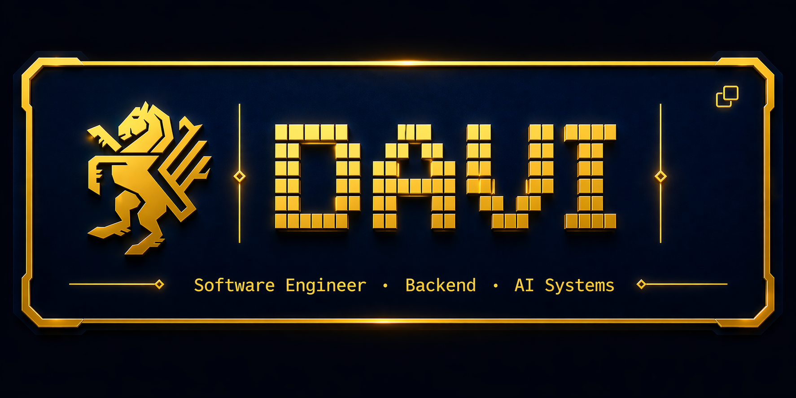

<div align="center">
  
  <br/>
  
</div>

<table>
  <tr>
    <td width="50%" valign="top">

```yaml
foco:  Backend · AI/RAG · Multi-tenant SaaS
stack: FastAPI · PostgreSQL · React · Docker
llms:  llama.cpp · FAISS · RAG Pipelines
```

    </td>
    <td width="50%" valign="top" align="center">
      
    </td>
  </tr>
</table>

<div align="center">
  
  
  
</div>

---

## 🚀 Sobre Mim

Desenvolvedor **Backend & AI Systems** com foco em arquiteturas escaláveis e pipelines de IA. Especializado em **RAG, LLMs e sistemas distribuídos** com Python e Java. Construindo soluções robustas sob a marca **[COUTO.dev](https://couto.dev)**.

---

## 🛠️ Tech Stack

<div align="center">

| **Backend** | **Databases** | **AI/ML** | **DevOps** |
|---|---|---|---|
| FastAPI · Flask | PostgreSQL · Redis | Ollama · FAISS | Docker · Kubernetes |
| Node.js · Express | MongoDB · Vector DB | LLMs · RAG | AWS · Linux |
| Spring Boot · Java | Qdrant | Whisper · pyannote | CI/CD · Nginx |

</div>

### 📚 Linguagens Principais


---

## 💡 Projetos em Destaque

<table>
  <tr>
    <td width="50%">
      <h3>🤖 RAG Atendimento Magalu</h3>
      <p><strong>Arquitetura:</strong> Clean Architecture + DDD</p>
      <p><strong>Stack:</strong> FastAPI · PostgreSQL · Ollama · FAISS</p>
      <p>Sistema de atendimento ao cliente com RAG em produção. Inclui autenticação JWT, vector embeddings e pipeline de conhecimento.</p>
    </td>
    <td width="50%">
      <h3>🌐 OctoHorse Website</h3>
      <p><strong>Arquitetura:</strong> Monorepo Full-Stack</p>
      <p><strong>Stack:</strong> React · TypeScript · Node.js · PostgreSQL</p>
      <p>Site corporativo com arquitetura moderna, documentação completa e deploy automatizado.</p>
    </td>
  </tr>
  <tr>
    <td width="50%">
      <h3>🔍 WikiAgent</h3>
      <p><strong>Tipo:</strong> AI Browser Automation</p>
      <p><strong>Stack:</strong> FastAPI · React · Ollama · Playwright</p>
      <p>Agente inteligente que navega e extrai informações da Wikipedia usando LLM local.</p>
    </td>
    <td width="50%">
      <h3>🏠 Sandiego Agent</h3>
      <p><strong>Tipo:</strong> Order Management Automation</p>
      <p><strong>Stack:</strong> FastAPI · React · Playwright · Magalu APIs</p>
      <p>Automação de pedidos com regras de negócio (TVC, reembolsos, marketplace 3P).</p>
    </td>
  </tr>
</table>

---

## 📊 Estatísticas de Atividade

<div align="center">
  
</div>

---

## 🔗 Conecte-se Comigo

<div align="center">

[](https://linkedin.com/in/davidocoutoinacio)
[](https://github.com/davidocoutoinacio-hash)
[](mailto:davi@couto.dev)
[](https://couto.dev)

</div>

---

## 🎯 Expertise

<div align="center">

| 🏗️ Arquitetura | 🤖 IA & ML | 🔐 Backend |
|---|---|---|
| **Microserviços** | **RAG Systems** | **APIs REST** |
| **Clean Architecture** | **LLM Agents** | **JWT & OAuth** |
| **DDD** | **Vector Databases** | **PostgreSQL** |
| **Event-Driven** | **Prompt Engineering** | **Caching Strategies** |
| **Multi-tenant SaaS** | **Fine-tuning** | **Rate Limiting** |

</div>

---

## 🏆 Realizations

- 🚀 **RAG em Produção** → Sistema de atendimento com arquitetura escalável
- 💾 **Vector DB Migration** → Auditoria e recomendação Qdrant
- 🔧 **Production Deployment** → WikiAgent + Nginx + Cloudflare + Fail2ban
- 📚 **Knowledge Base System** → Estruturado com embeddings Ollama
- 🤝 **DDD & Clean Code** → Refatoração completa MVP→Production

---

## 📖 Learning Path

```
Q2 2026: Spring Boot Mastery
├─ Advanced JPA & Hibernate
├─ Spring Security (OAuth2, JWT)
├─ Microservices Patterns
└─ Deployment com Docker & K8s

Q3 2026: System Design
├─ Distributed Systems
├─ Database Optimization
├─ Load Balancing & Caching
└─ Blockchain Fundamentals

Q4 2026: AI Integration
├─ LLMOps & Fine-tuning
├─ RAG at Scale
└─ Production ML Pipelines
```

---

## 🔓 Open Contributions

Buscando contribuir em:
- 🎯 **Ollama** — Local LLM tooling
- 📦 **FastAPI** — Modern Python web framework
- 🗄️ **Qdrant** — Vector database
- 🎨 **Shadcn/ui** — React component library

---

## 💼 Freelance & Consulting

**COUTO.dev** — Desenvolvimento de soluções Backend, RAG Systems e AI Integration

📮 **Interessado em colaborar?**
- **99freelas**: [@COUTO.dev](https://99freelas.com.br)
- **Email**: davi@couto.dev
- **LinkedIn**: [davidocoutoinacio](https://linkedin.com/in/davidocoutoinacio)

---

## 📈 Goals 2026

- [ ] Certificação Spring Professional
- [ ] 1º Produto SaaS em produção
- [ ] 50+ contribuições open-source
- [ ] 10k seguidores GitHub
- [ ] Deep Dive em Kubernetes & ArgoCD

---

<div align="center">
  
  
  **Desenvolvendo o futuro com código e IA** 🚀
  
  <sub>Made with ❤️ by <a href="https://couto.dev">COUTO.dev</a></sub>
</div>
