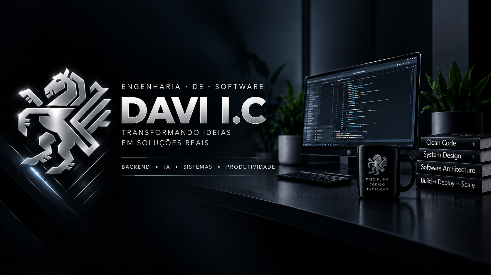
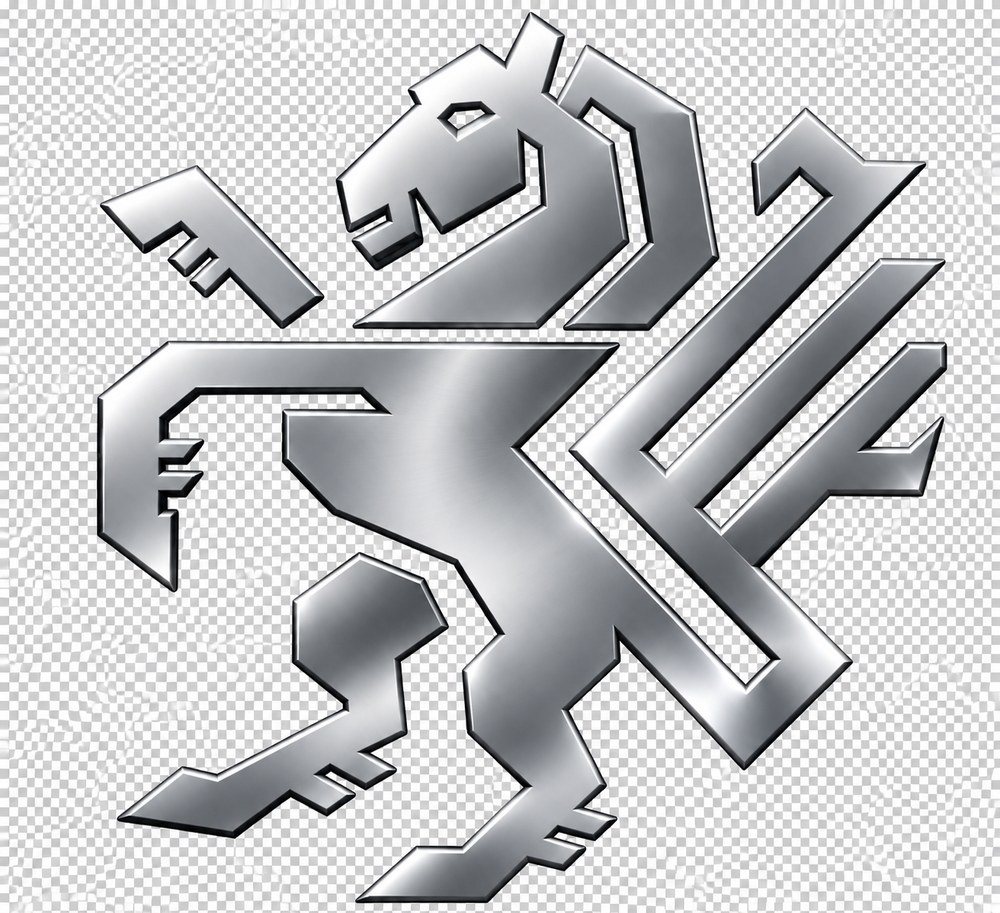

<!-- ===================================================== -->
<!--                    DAVI I.C                           -->
<!--              Engenharia de Software                  -->
<!-- ===================================================== -->

<div align="center">



<br/>

<table>
<tr>

<td align="center">
🎓
<br/>
<b>Estudante de Engenharia de Software</b>
</td>

<td align="center">
💻
<br/>
<b>Desenvolvedor Backend</b>
</td>

<td align="center">
🧠
<br/>
<b>Construindo soluções com IA</b>
</td>

<td align="center">
📊
<br/>
<b>Sempre aprendendo</b>
</td>

</tr>
</table>

</div>


## Olá, eu sou o Davi! 👋

<table>
<tr>

<td width="52%" valign="top">

Estudante de **Engenharia de Software** e apaixonado por tecnologia.

Gosto de transformar problemas em soluções, desenvolver sistemas escaláveis e explorar o potencial da **Inteligência Artificial**.

Meu foco é **backend, arquitetura de sistemas e produtos que geram impacto real**.

</td>

<td width="30%" valign="top">

📧 **Email**  
[davidocoutoinacio@gmail.com](mailto:davidocoutoinacio@gmail.com)

🔗 **Portfólio**  
[https://davicouto.octohorse.com.br](https://davicouto.octohorse.com.br/)

💼 **LinkedIn**  
[linkedin.com/in/davi-inacio-685297363](https://linkedin.com/in/davi-inacio-685297363)

📍 **Brasil**

</td>

<td width="18%" align="center" valign="middle">

> *"Disciplina hoje,*  
> *liberdade amanhã."*

**— Davi I.C**

</td>

</tr>
</table>


## Tecnologias e Ferramentas

<div align="center">


<br/>


</div>


<br/>


<!-- ===================================================== -->
<!--                    GITHUB STATS                       -->
<!-- ===================================================== -->

<table>
<tr>

<td width="50%" align="center">

### Estatísticas do GitHub


</td>

<td width="50%" align="center">

### Linguagens Mais Usadas


</td>

</tr>
</table>


## Gráfico de Contribuições

<div align="center">


</div>


<br/>


<!-- ===================================================== -->
<!--                 ACTIVITY + METRICS                    -->
<!-- ===================================================== -->

<table>

<tr>

<td width="50%" valign="top">

### ⚡ Atividade Recente

<!--START_SECTION:activity-->

`→` Fez push em **MedPlant-API**

`→` Abriu um pull request em **Vso-Medical-App**

`→` Fez push em **OctoSite**

`→` Revisou um pull request

`→` Contribuiu em **NMIro-OrquestradorIA**

<!--END_SECTION:activity-->

</td>


<td width="50%" align="center">

### Visão Geral de Contribuições

```text
Commits        ███████████████████░  95%
Pull Requests  █░░░░░░░░░░░░░░░░░░   5%
Issues         ░░░░░░░░░░░░░░░░░░░   0%
Code Review    ░░░░░░░░░░░░░░░░░░░   0%
```

</td>

</tr>

</table>


<!-- ===================================================== -->
<!--                    PROJECTS                           -->
<!-- ===================================================== -->

## Projetos em Destaque

<table>
<tr>

<td width="33%" valign="top">

### 🖥️ [apresenta](https://github.com/davidocoutoinacio-hash/apresenta)

`Public`

Portfólio pessoal e apresentação de projetos.

<br/>


⭐ 12 &nbsp;&nbsp; 🍴 3

</td>


<td width="33%" valign="top">

### 🖥️ [NMIro-OrquestradorIA](https://github.com/davidocoutoinacio-hash/NMIro-OrquestradorIA)

`Public`

Orquestração visual de múltiplos agentes de IA em CLI, num canvas espacial local.

<br/>


⭐ 2 &nbsp;&nbsp; 🍴 1

</td>


<td width="33%" valign="top">

### 🖥️ [Vso-Medical-App](https://github.com/davidocoutoinacio-hash/Vso-Medical-App)

`Public`

Sistema completo para gestão médica.

<br/>


⭐ 5 &nbsp;&nbsp; 🍴 2

</td>

</tr>
</table>


<br/>


<!-- ===================================================== -->
<!--                    OCTOHORSE                          -->
<!-- ===================================================== -->

<table>
<tr>

<td width="70%" valign="middle">

### ❝

### *Construindo hoje o desenvolvedor que quero ser amanhã.*

</td>

<td width="30%" align="center">



<br/>

**O C T O H O R S E**

<sub>DEVELOPMENT</sub>

</td>

</tr>
</table>


<br/>


<!-- ===================================================== -->
<!--                    CONTACT                            -->
<!-- ===================================================== -->

<div align="center">

<a href="https://linkedin.com/in/davi-inacio-685297363">
  
</a>

<a href="mailto:davidocoutoinacio@gmail.com">
  
</a>

<a href="https://davicouto.octohorse.com.br/">
  
</a>

<a href="https://github.com/davidocoutoinacio-hash">
  
</a>

</div>


<br/>


<div align="center">


### OCTOHORSE DEVELOPMENT

<sub>Backend • Inteligência Artificial • Sistemas • Engenharia de Software</sub>

</div>
