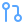
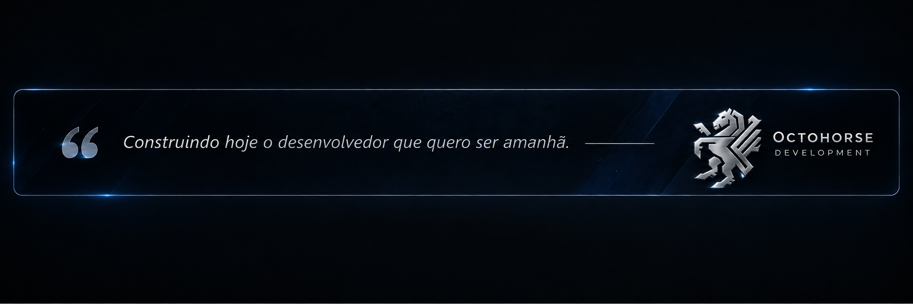

<!-- ====================================================== -->
<!--                    OCTOHORSE                            -->
<!--                   DAVI I.C                              -->
<!-- ====================================================== -->

 

<!-- ====================================================== -->
<!--                    PROFILE TAGS                         -->
<!-- ====================================================== -->

<table width="100%">
<tr>

<td width="25%" align="center">
  
    
  <strong>Estudante de Engenharia de Software</strong>
</td>

<td width="25%" align="center">
  
    
  <strong>Desenvolvedor Backend</strong>
</td>

<td width="25%" align="center">
  
    
  <strong>Construindo soluções com IA</strong>
</td>

<td width="25%" align="center">
  
    
  <strong>Sempre aprendendo</strong>
</td>

</tr>
</table>

 

<!-- ====================================================== -->
<!--                     ABOUT                              -->
<!-- ====================================================== -->

<h2>Olá, eu sou o Davi.</h2>

<table width="100%">
<tr>

<td width="47%" valign="top">

### Engenharia de Software

Estudante de **Engenharia de Software** e apaixonado por tecnologia.

Gosto de transformar problemas em soluções, desenvolver sistemas escaláveis e explorar o potencial da **Inteligência Artificial**.

Meu foco está em:

`Backend` · `Arquitetura de Sistemas` · `Inteligência Artificial` · `Software`

</td>

<td width="33%" valign="top">

<table>

<tr>
<td>

</td>
<td>
<a href="mailto:davidocoutoinacio@gmail.com">
davidocoutoinacio@gmail.com
</a>
</td>
</tr>

<tr>
<td>

</td>
<td>
<a href="https://davicouto.octohorse.com.br/">
davicouto.octohorse.com.br
</a>
</td>
</tr>

<tr>
<td>

</td>
<td>
<a href="https://linkedin.com/in/davi-inacio-685297363">
davi-inacio-685297363
</a>
</td>
</tr>

<tr>
<td>

</td>
<td>
Brasil
</td>
</tr>

</table>

</td>

<td width="20%" align="center" valign="middle">

DISCIPLINA HOJE

 

<strong>LIBERDADE AMANHÃ.</strong>

  

— DAVI I.C

</td>

</tr>
</table>

 

<!-- ====================================================== -->
<!--                   TECHNOLOGIES                          -->
<!-- ====================================================== -->

<h2>Tecnologias e Ferramentas</h2>

 

 

<!-- ====================================================== -->
<!--                     GITHUB                              -->
<!-- ====================================================== -->

<h2>GitHub</h2>

<table width="100%">
<tr>

<td width="50%" align="center">

<strong>Estatísticas</strong>

  

</td>

<td width="50%" align="center">

<strong>Linguagens Mais Usadas</strong>

  

</td>

</tr>
</table>

 

<!-- ====================================================== -->
<!--                   CONTRIBUTIONS                         -->
<!-- ====================================================== -->

<h2>Gráfico de Contribuições</h2>

 

<!-- ====================================================== -->
<!--                    ACTIVITY                             -->
<!-- ====================================================== -->

<table width="100%">
<tr>

<td width="52%" valign="top">

<table>
<tr>
<td>

</td>
<td>
<h3>Atividade Recente</h3>
</td>
</tr>
</table>

<table>

<tr>
<td>

</td>
<td>
Fez push em <strong>MedPlant-API</strong>
</td>
</tr>

<tr>
<td>

</td>
<td>
Abriu um pull request em <strong>Vso-Medical-App</strong>
</td>
</tr>

<tr>
<td>

</td>
<td>
Fez push em <strong>OctoSite</strong>
</td>
</tr>

<tr>
<td>

</td>
<td>
Revisou um pull request
</td>
</tr>

<tr>
<td>

</td>
<td>
Contribuiu em <strong>NMIro-OrquestradorIA</strong>
</td>
</tr>

</table>

</td>

<td width="48%" valign="top">

<h3 align="center">Visão Geral</h3>

<table width="100%">

<tr>
<td>Commits</td>
<td>

</td>
<td>95%</td>
</tr>

<tr>
<td>Pull Requests</td>
<td>

</td>
<td>5%</td>
</tr>

<tr>
<td>Issues</td>
<td>

</td>
<td>0%</td>
</tr>

<tr>
<td>Code Review</td>
<td>

</td>
<td>0%</td>
</tr>

</table>

</td>

</tr>
</table>

 

<!-- ====================================================== -->
<!--                    PROJECTS                             -->
<!-- ====================================================== -->

<h2>Projetos em Destaque</h2>

<table width="100%">
<tr>

<td width="33%" valign="top">

<table>
<tr>
<td>

</td>
<td>
<a href="https://github.com/davidocoutoinacio-hash/apresenta">
<strong>apresenta</strong>
</a>
</td>
</tr>
</table>

PUBLIC

  

Portfólio pessoal e apresentação de projetos.

  

  

</td>

<td width="33%" valign="top">

<table>
<tr>
<td>

</td>
<td>
<a href="https://github.com/davidocoutoinacio-hash/NMIro-OrquestradorIA">
<strong>NMIro-OrquestradorIA</strong>
</a>
</td>
</tr>
</table>

PUBLIC

  

Orquestração visual de múltiplos agentes de IA em CLI, num canvas espacial local.

  

  

</td>

<td width="33%" valign="top">

<table>
<tr>
<td>

</td>
<td>
<a href="https://github.com/davidocoutoinacio-hash/Vso-Medical-App">
<strong>Vso-Medical-App</strong>
</a>
</td>
</tr>
</table>

PUBLIC

  

Sistema completo para gestão médica.

  

  

</td>

</tr>
</table>

 

<!-- ====================================================== -->
<!--                    QUOTE                               -->
<!-- ====================================================== -->

 

<!-- ====================================================== -->
<!--                    CONTACT                             -->
<!-- ====================================================== -->

  

<!-- ====================================================== -->
<!--                 OCTOHORSE FOOTER                        -->
<!-- ====================================================== -->

 

<h3>O C T O H O R S E</h3>

DEVELOPMENT

  

BACKEND &nbsp; · &nbsp;
INTELIGÊNCIA ARTIFICIAL &nbsp; · &nbsp;
SISTEMAS &nbsp; · &nbsp;
ENGENHARIA DE SOFTWARE

